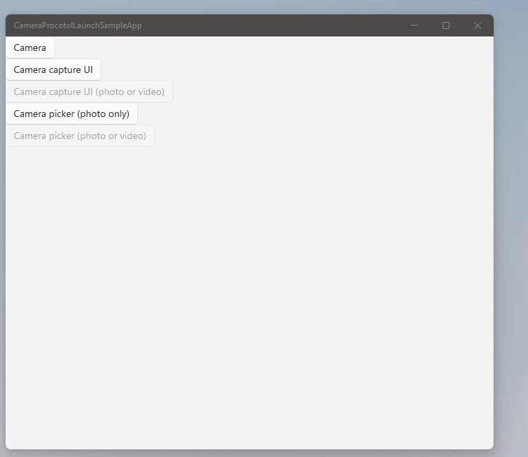
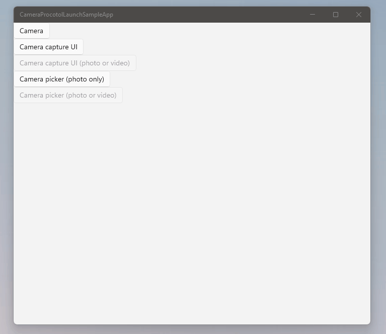

# Camera protocol launch samples

1. Launch the Camera App to capture a photo.

2. Use [Camera CaptureUI](https://docs.microsoft.com/en-us/uwp/api/windows.media.capture.cameracaptureui?view=winrt-22621) to capture a photo.

